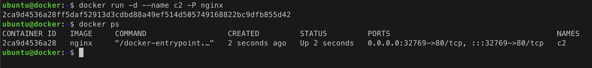

# Publish vs Expose

## Mapping de port (publish)

### Exécuter un container nginx avec publication de port

```bash
# Définition du port
docker run -d --name c1 -p 8080:80 nginx:latest
```

La commande docker ps indique le mapping de port

<figure><figcaption></figcaption></figure>

### Vérification

* Récupérer l'adresse IP de la machine virtuelle
* Depuis un nouveau terminal, tester le curl vers le container

```bash
curl <Host IP>:8080
```

### Exécuter un container nginx avec publish all

```bash
# Publish all
docker run -d --name c2 -P nginx:latest
```

La commande docker ps indique le mapping de port

<figure><figcaption></figcaption></figure>

### Vérification

* Récupérer l'adresse IP de la machine virtuelle
* Depuis un nouveau terminal, tester le curl vers le container


Attention au numéro de port attribué aléatoirement


## Exposition du container (expose)

### Exécuter un container nginx avec expose

```bash
docker run -d --name c3 --expose 8080 nginx:latestsh
```


la commande EXPOSE peut aussi être utilisée au moment du build


### Vérification

* Afficher la liste des réseaux
* Afficher le détail du réseau bridge&#x20;

```bash
docker network ls
docker network inspect <ID bridge network>
```

* Récupérer l'IP du container
* Tester la commande sur les ports 80 et 8080

> Quel est le résultat et comment vérifier si les ports sont mappés ?
