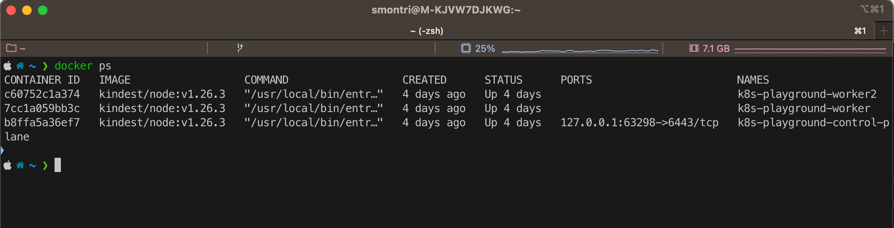

# Module Docker

Ce dépôt contient les exercices du module Docker pour le campus Mewo de Metz.

### Pré-requis

Nous allons utiliser l'application Docker Desktop tout au long de ces exercices dédiés à l'environnement Docker. Celui-ci doit donc être installé sur votre poste de travail.

Pour exécuter des containers, nous avons besoin d'un engine Docker qui est fourni par l'application Desktop de Docker.

<figure><figcaption></figcaption></figure>

Afin de s'assurer que Docker est bien présent sur la machine, il suffit de lancer la commande suivante :

```docker
docker ps
```

Si Docker est présent, l'output de la commande doit ressembler à cela :

<figure><figcaption></figcaption></figure>


L'exemple ci-dessus est un exemple, en principe la liste de containers doit être vide dans votre cas



Si Docker n'est pas présent, merci de l'installer !

