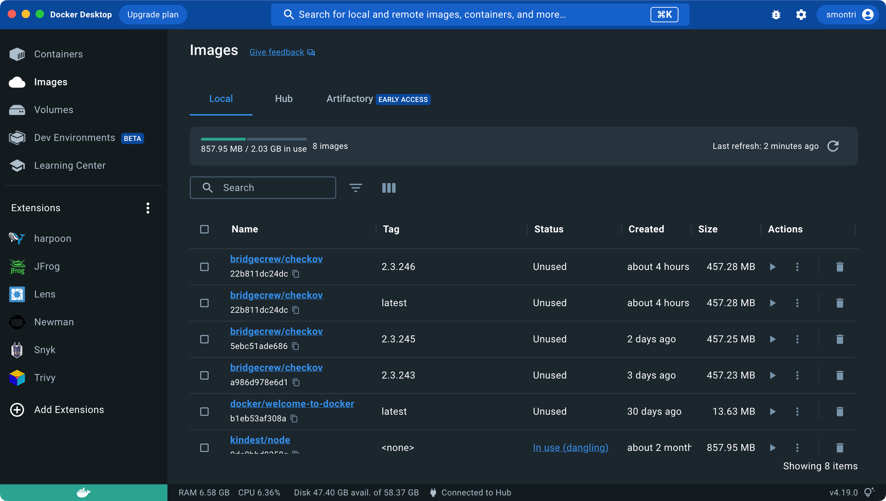

# Pré-requis

Nous allons utiliser l'application Docker Desktop tout au long de ces exercices dédiés à l'environnement Docker. Celui-ci doit donc être installé sur votre poste de travail.

Pour exécuter des containers, nous avons besoin d'un engine Docker qui est fourni par l'application Desktop de Docker.

<figure><figcaption></figcaption></figure>
